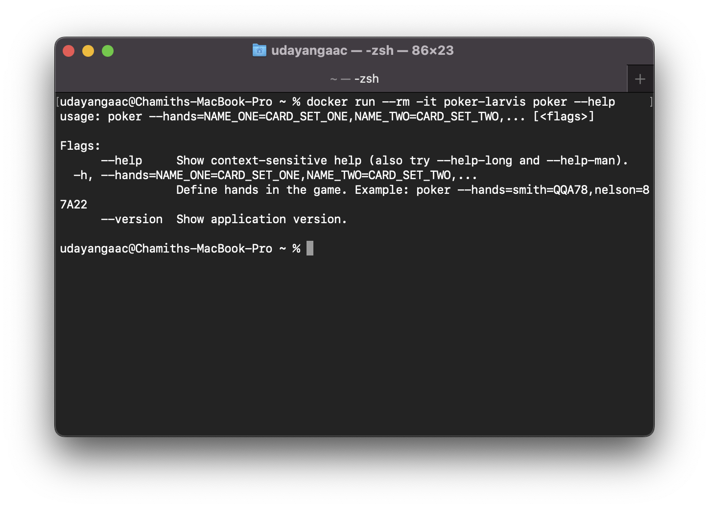

# poker-larvis
Poker LARVIS is a command-line poker hand evaluator module. It simulates a conversation between a human and an AI assistant named LARVIS.


## Getting Started

### With Docker

Open Terminal inside the project folder. __Docker__ should be installed in computer. Follow the following steps to run the `poker-larvis`. Cheers !!!

- Build the docker image.
```zsh
docker build -t poker-larvis .
```

- Run the docker image and test tha application.
```zsh
docker run --rm -it poker-larvis poker --help
```
Output:


__Example:__  
> NOTE: String with spaces should be wrapped with _apostrophes_.
```zsh
docker run --rm -it poker-larvis poker --hands='Hand 1'=AAQAA,'Hand 2'=22356

```

### Without Docker

Open Terminal inside the project folder. Follow the following steps to run the `poker-larvis`. Cheers !!!  
__Note__: Golang version = 1.19
- Download  dependencies.

```zsh
go mod vendor
```
- Build the project.

```zsh
go build -o bin/poker cmd/poker/poker.go
```
- Test the application.
```zsh
 bin/poker --help
```

__Example:__  
> NOTE: String with spaces should be wrapped with _apostrophes_.
```zsh
bin/poker --hands='Hand 1'=AAQAA,'Hand 2'=22356
```
## Used packages

| Name | Github | Reason |
|---|---|---|
|kingpin|https://github.com/alecthomas/kingpin| This library was applied as the command line parser.|
|testify|https://github.com/stretchr/testify| This library was used to improve the readability of my test cases. Test Driven Development (TDD) was used in this situation. |


## Implementation
### Project Structure  
Below project structure was used to develop this CLI application in terms of design decisions.


### How does __POKER LARVIS__ decide the winner ?

- Score each card according to the table below.

| Card      | Score |
| --------- | ----- |
| 2         | 2     |
| 3         | 3     |
| 4         | 4     |
| 5         | 5     |
| 6         | 6     |
| 7         | 7     |
| 8         | 8     |
| 9         | 9     |
| T (10)    | 10    |
| J (Jack)  | 11    |
| Q (Queen) | 12    |
| K (King)  | 13    |
| A (Ace)   | 14    |

- Calculate the sum of the squares of the character counts to rank the hands based on card combinations.

| Cards    | Type           | Characters' counts                                  | Square of sum                    |
| -------- | -------------- | --------------------------------------------------- | -------------------------------- |
| `77377`  | Four of a kind | 7 -> 4 cards, 3 -> One card                         | $4^2 + 1^2 = 17$                 |
| `KK2K2`  | Full house     | K -> 2 cards, 2 -> 2 cards                          | $3^2 + 2^2 = 13$                 |
| `32666 ` | Triple         | 6 -> 3 cards, 2 and 3 -> One card from each         | $3^2 + 1^2 + 1^2 = 11$           |
| `77332 ` | Two pair       | 7 -> 2 cards, 3 -> 2 Cards, 2 -> One card from each | $2^2 + 2^2 + 1^2 = 9$            |
| `43K9K ` | A pair         | K -> 2 cards, 4, 3 and 9 -> One card from each      | $2^2 + 1^2 + 1^2 + 1^2= 7$       |
| `43K9K ` | High card      | One card from each                                  | $1^2 + 1^2 + 1^2 + 1^2 + 1^2= 5$ |

We can rank the hands based on the card combinations in accordance with the computation above. whoever has the highest wins. If multiple hands have the same highest value, the score must be calculated for each.

__Example:__
Hand 1 has `77377` and Hand 2 has `QQ3QQ` Based on the card combination, both hands have a same highest rank. Then we need to calculate the score for both hands. 

`77377` -> $7 + 7 + 3 + 7 + 7 = 31$  
`QQ3QQ` -> $12 + 12 + 3 + 12 + 12 = 51$  

Hand 2 has the highest score and wins!!